# Linux Assignment Set
## **Assignment 1**

### **Connect and disconnect with login Access**

- What happens when you login a non-existent users or username?

  - Provide Screenshot and What you understand, explain in short brief?

    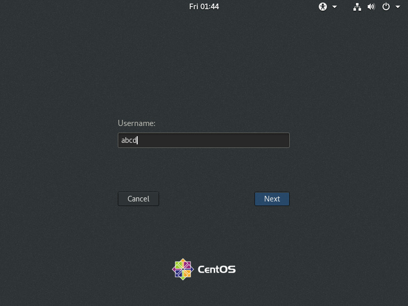

    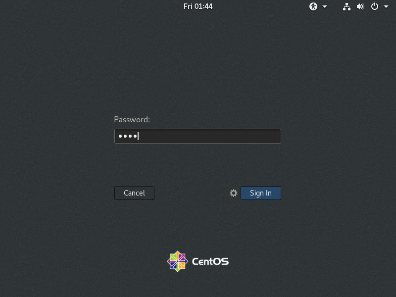

    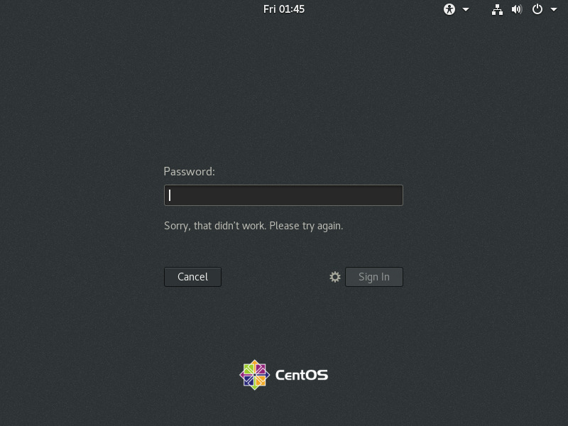

    - Cant login to a non-existent username.

---

## **Assignment 2**

### **Password changing**

- Login into your account and then change password?

  - Change your password into IneuR0n#42 and hit the Enter key

    - Explain what happen and give screenshot?

    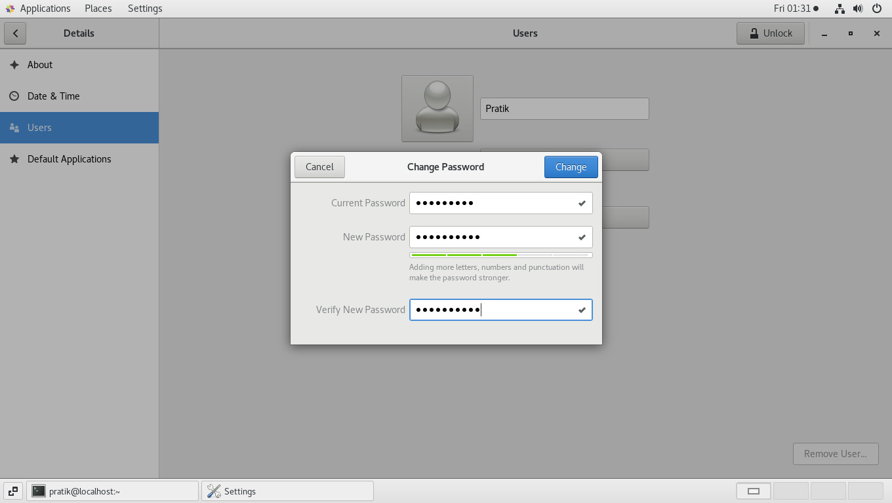

    - User login password is changes to new password.

- Try again to change password but use like password 1234 or abcd

  - Explain what happen and give screenshot?

    

    - Doesnt allows to change password to generic sequences like "1234".

- Try again to change password but now don’t use any password just hit Enter key

  - Explain what happen and give screenshot?

    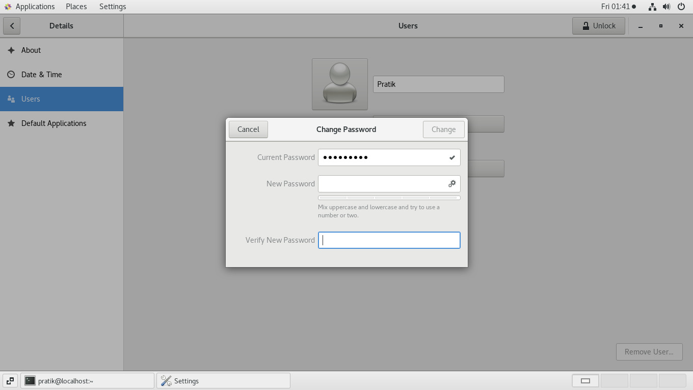

    - Cant change password.

---
## **Assignment 3**

### **Working with Directories**

- Enter the command cd / and then ls and then hit Enter key

  - Take screenshot and explain what output we got?

    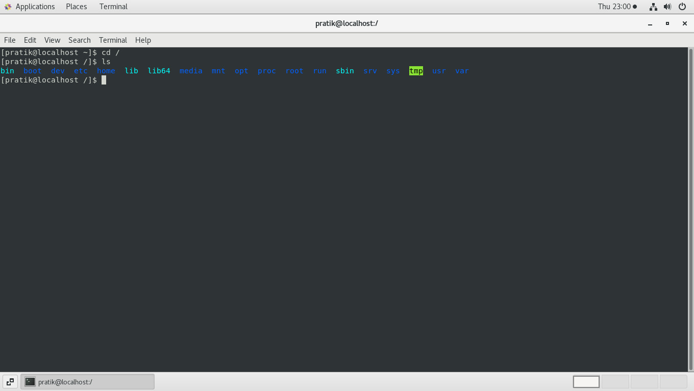

    - "/" is the root directory in linux OS.
    - Everything in linux begins from this directory.

- Enter the command now cd /home and then hit Enter key

  - Do ls, provide screenshot and explain what is /home directory used for?

    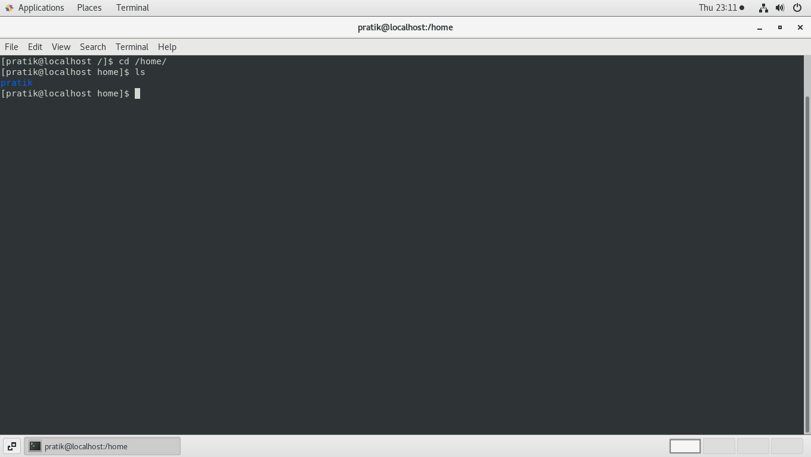

    - /home directory lists the number of directories for specific users in system.

- Enter cd .. and hit Enter key [ Note: here we have space after cd then use double dot]

  - Check what happen and give screenshot?

    

    - It takes us to / directory ie one directory up.

- Now enter cd /var/www/html and then type cd and hit Enter key

  - Explain what happen and give screenshot?

    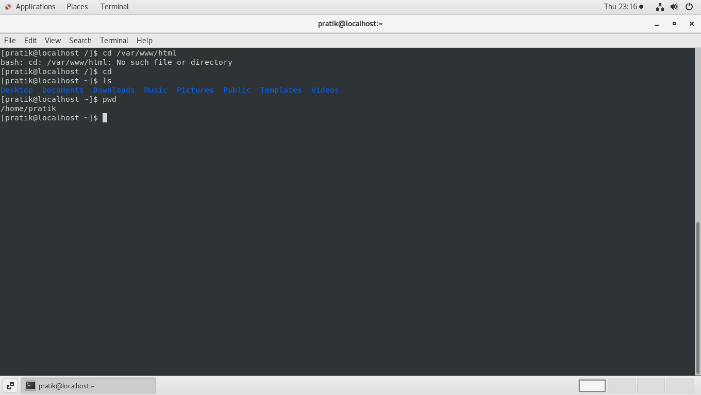

    - Since there is not such folder such as www/html inside /var it gave us the error that "No such file or folder"
    
    - cd + Enter takes us to the home directory of the user.

- Now type cd /root and then hit Enter key

  - Do ls, check any output we have on screen if yes then take screenshot?

    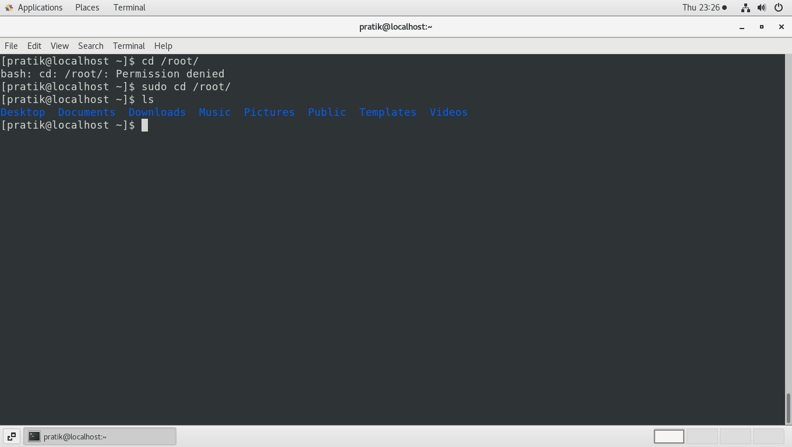
    
---
## **Assignment 4**

### **Working with File Listing**

- Go to cd /etc and type ls

  - Take screenshot and explain what files you have seeing?
  - Take screenshot and explain what different output you found compare to previous command you used?

    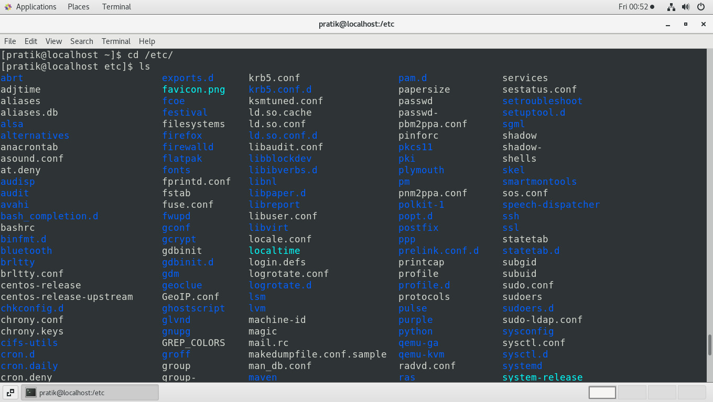

    - System configuration files are stored in /etc


- Then type ls -al and hit Enter key

  - Take screenshot and explain what new file or directory you found?

    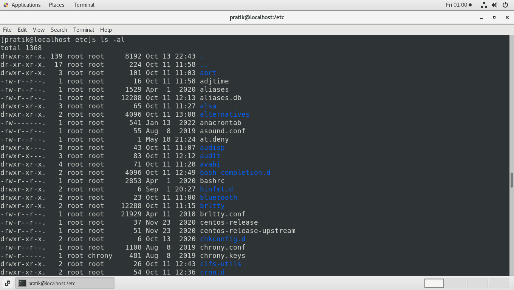

    - *ls -l* : to list files and folders is list format
    - *ls -a* : to list all files and folders (including hidden files) in current directory
    - *ls -la* : to list all files and folders (including hidden files) is list format

- Then use ls -i and hit Enter key

  - Now see what different output its shows and take screenshot?

    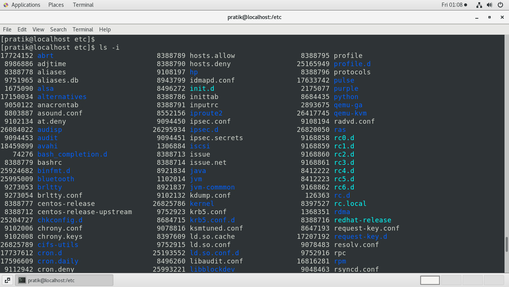

    - Displays all files in list format along with its inode number.
    - inode number is a unique identidfier for a specific piece of metadata on a given filesystem.

- Then use ls –help and see other options about ls command

  - Explore it and try with other attribute we can use with ls command

    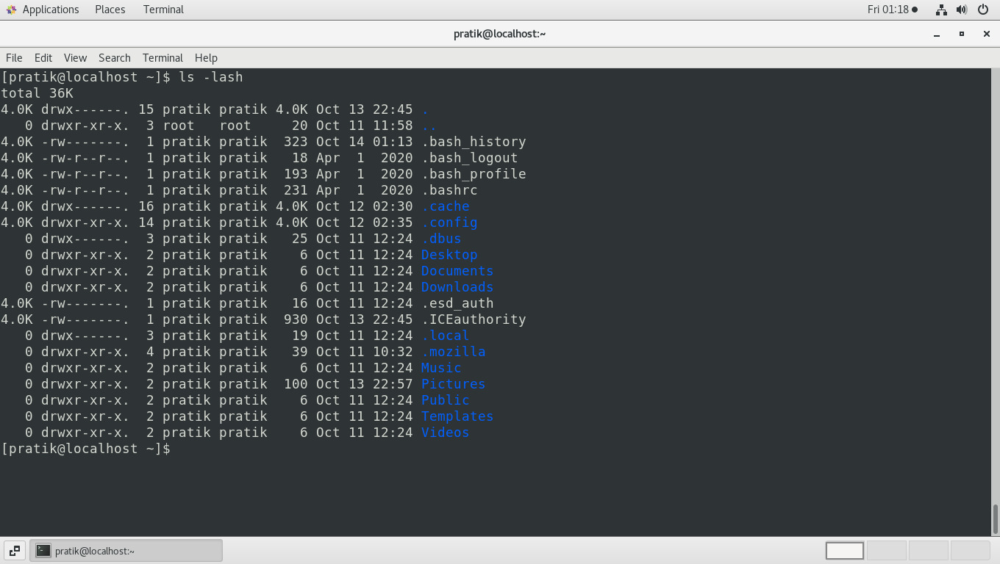

    - ls -s: shows size of each file.
    - ls -h: shows sizes in human readable format

---

## **Assignment 5**

### **Know where your are and where you are working.**

- Here we use commands :
  - *pwd* : to find current/present working directory
  - *cd* : to change directory or go into other folder
  - *ls* : to list files and folders in current directory


- Open terminal after restart the linux. 

  - Check which location you working, type pwd and take screenshot.

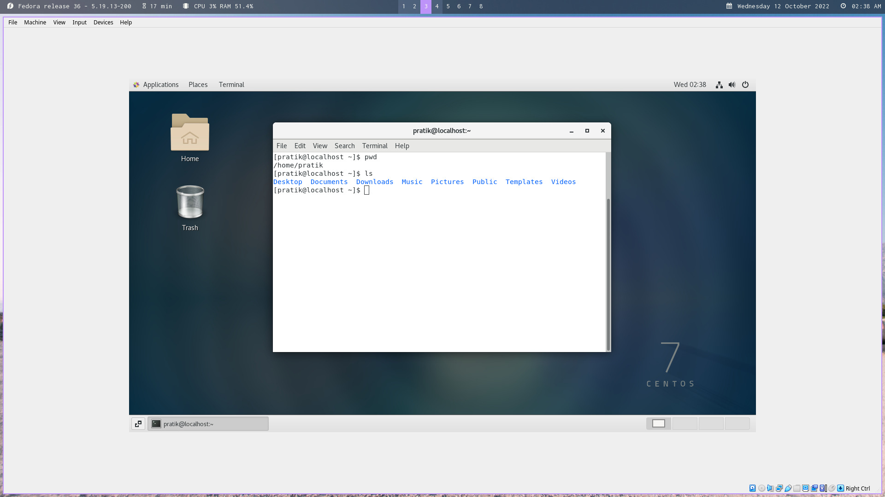

- Now use cd /var and hit Enter key.

  - Do ls, and see what output comes, give screenshot?

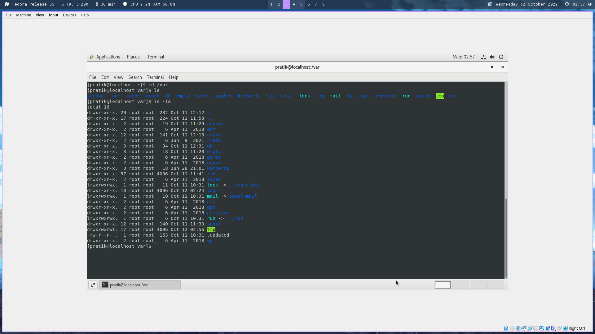

- Do explore other help options of each command to learn more other things we can do with these commands

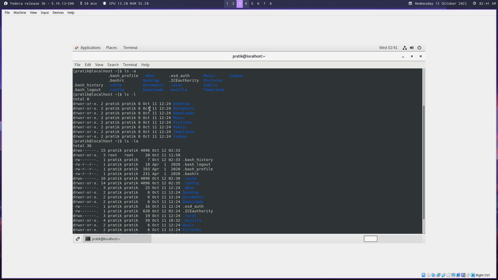

- Here we use commands:

  - *ls -l* : to list files and folders is list format
  - *ls -a* : to list all files and folders (including hidden files) in current directory
  - *ls -la* : to list all files and folders (including hidden files) is list format

---

## **Extra Assignment 1**

### System was updated using command 

```
sudo yum update
```

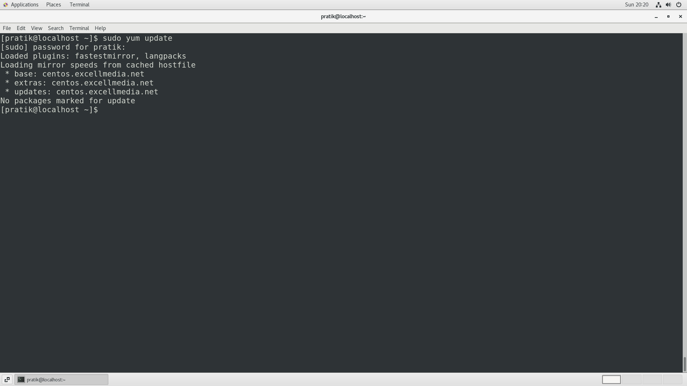

---

## **Extra Assignment 2**

### Was able to run Virtual machine in fullscreen after installing gcc, kernel-devel-$(uname -r), elfutils-libelf-devel

```
sudo yum install gcc

sudo yum install kernel-devel-$(uname -r)

sudo yum install elfutils-libelf-devel

```

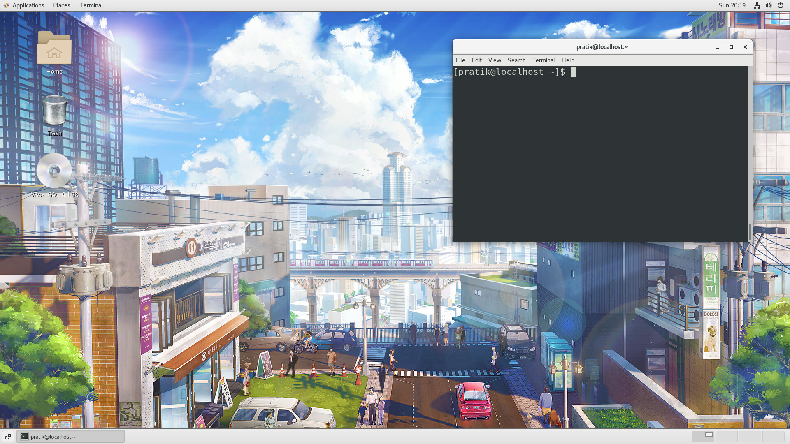

---