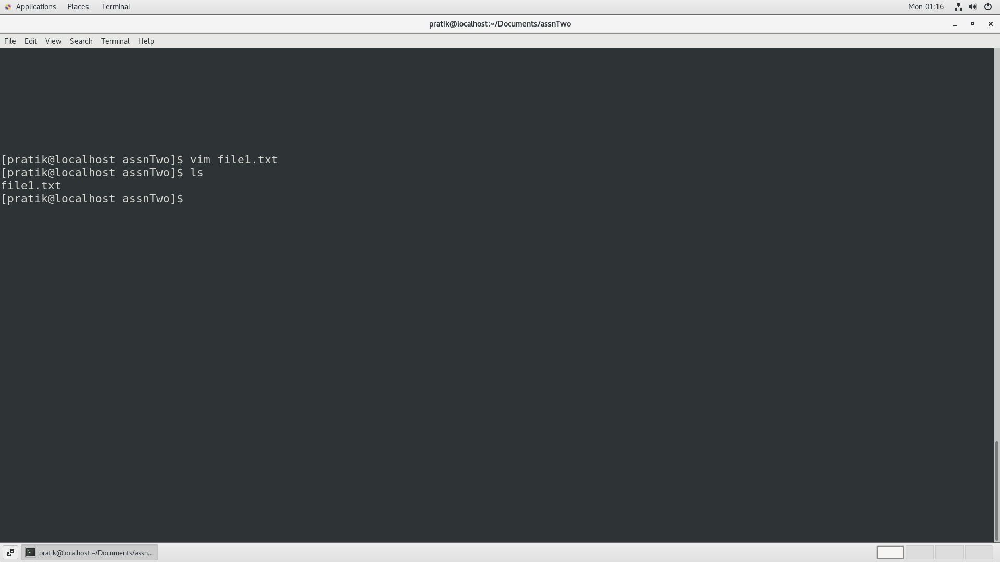
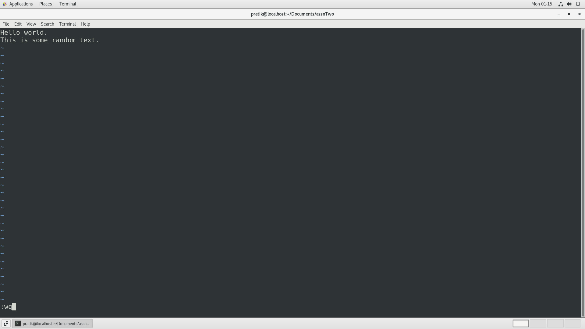
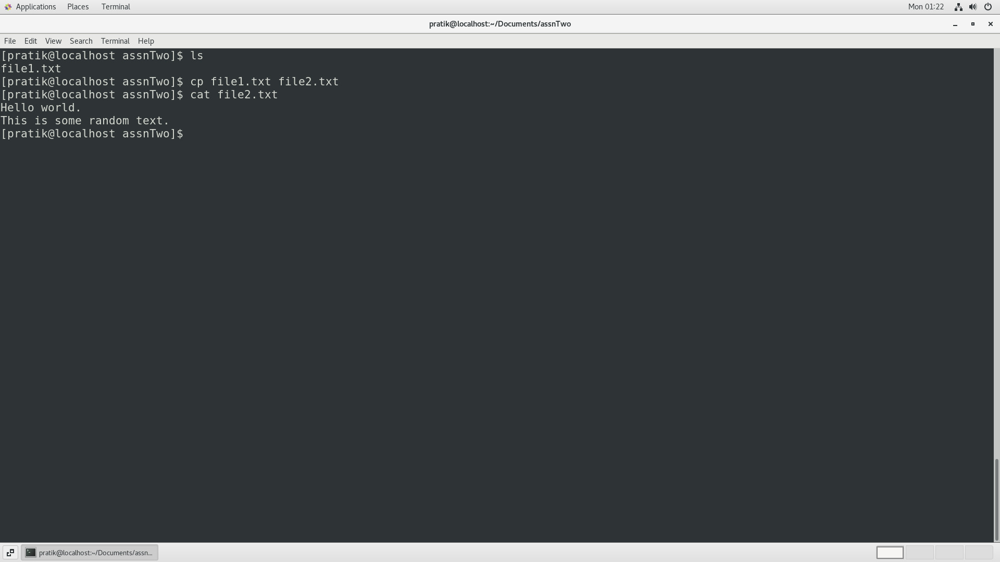
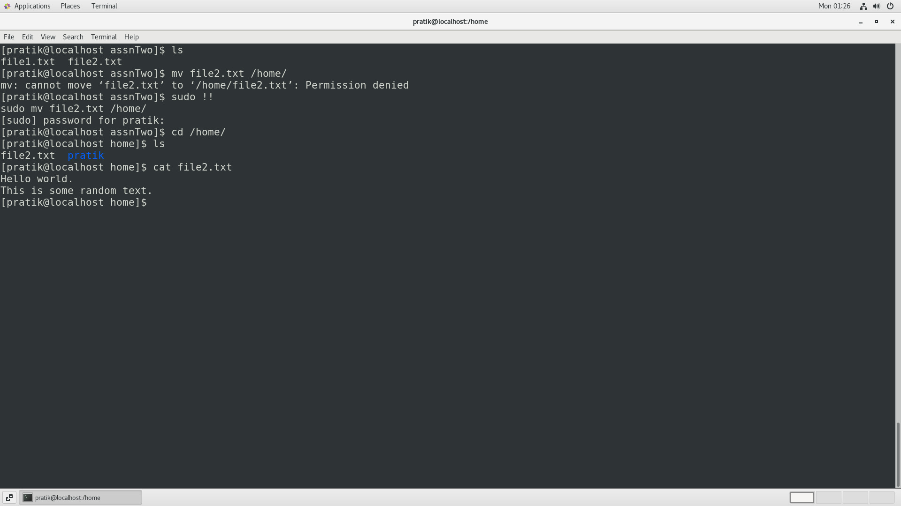
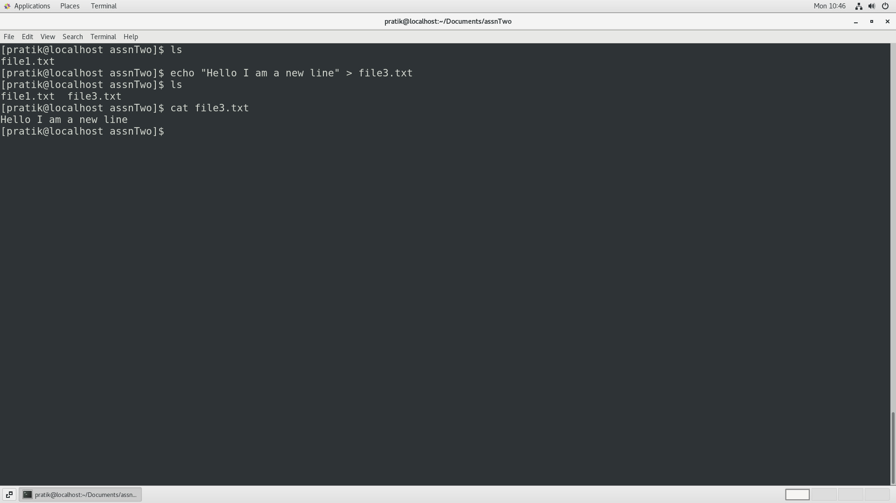
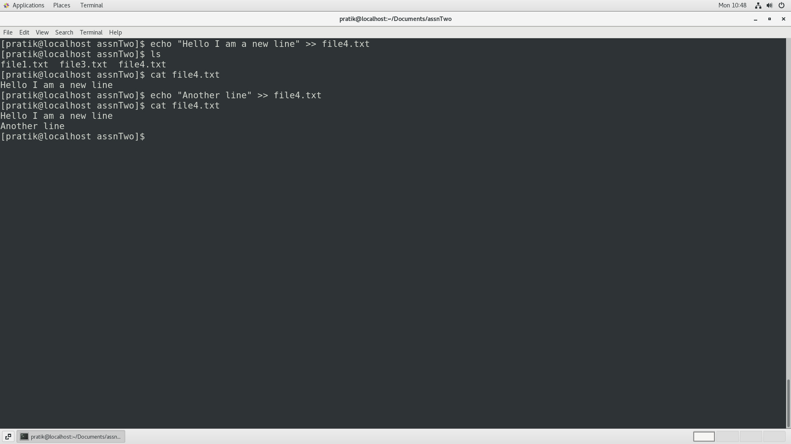
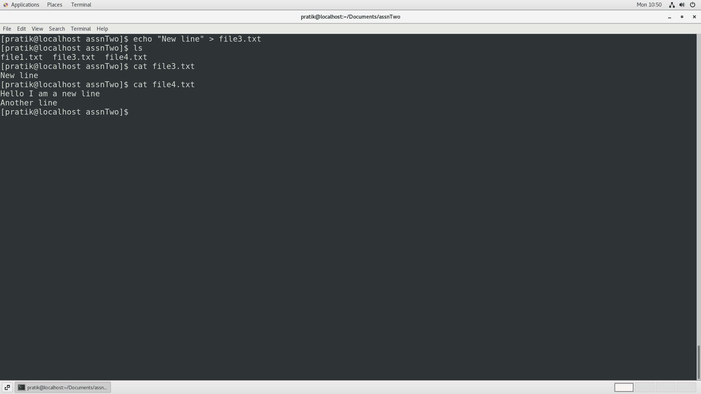
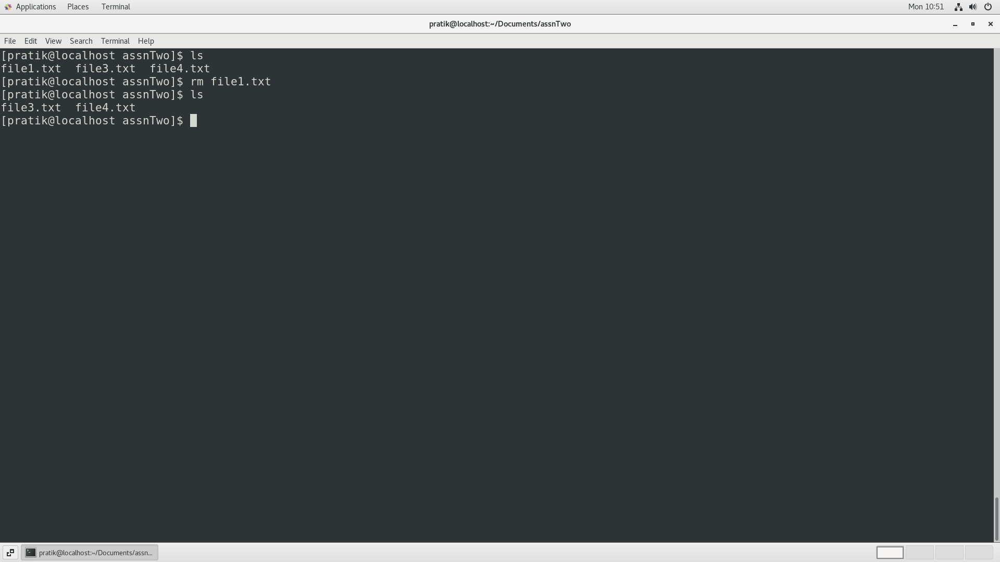
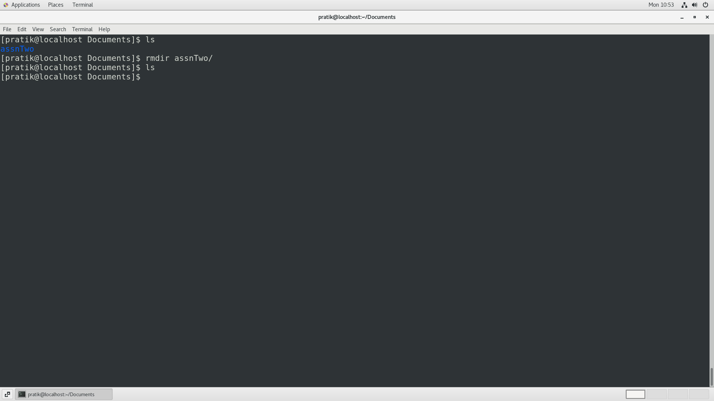

# Linux Assignment Set
## **Assignment 2**

Playing with files.

---

### 1. Create a file like nano file1.txt

- Edit some data and then save the file.

  

  

---

### 2. Now we will copy data from file1 to new file2 

- cp file1.txt file2.txt
- Output of file2.txt

  

---

### 3. Now we move the file2.txt to new folder /home

- mv file2.txt /home
- Then go to home directory and check ls, file exists or not ?

  

--- 

### 4. Then we create a new file3.txt and file4.txt in home directory and add content in it.

- Now do echo “Hello I am newline” > file3.txt and provide the output of file3.txt.

  

- Now do echo “Hello I am newline” >> file4.txt and provide the output of file4.txt.

  

- Tell the different between both step you follow and the reason behind it.

  cat > filename is used to create or overwrite a file.

  cat >> filename is used to append txt to a file.

  

---

### 5. For remove a file or directory you can use the below two commands.

- To delete a file – rm <any_filename>

  

- To delete a directory - rmdir <any_directory name>

  

---