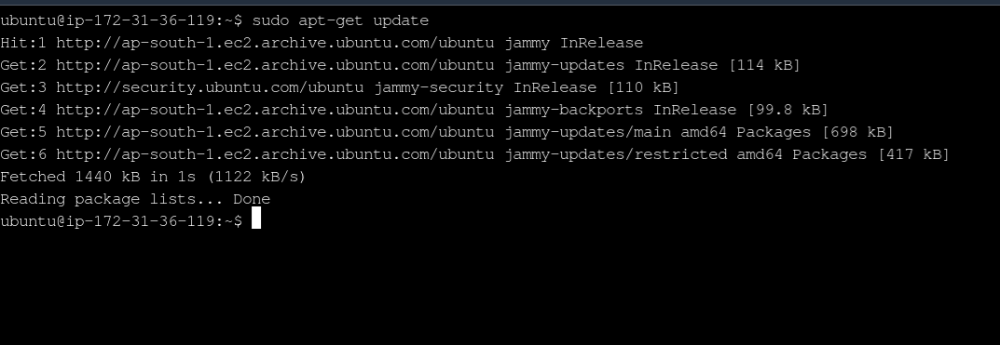

## **Assignment 3**

---

### Assignment 1 :- Create an IAM user with username of your own wish and grant administrator policy.

- Created a user group named **admin** and added _AdministratorAccess_ policy.

  

  

- Created a user named **firstuser** and added this user to **admin** group which has _AdministratorAccess_ policy.

  

---

### Assignment 2 :- Hello students, in this assignment you need to prepare a developers team of avengers. Create 3 IAM users of avengers and assign them in developer’s groups with IAM policy.

- Created a user group named **avengers** and added _AdministratorAccess_ policy.

  

- Created 3 users **ironman, hulk, thor** and added them to user group **avengers** having _AdministratorAccess_ policy.

  

---

### Assignment 3 Define a condition in policy for expiration like

"DateGreaterThan": {"aws:CurrentTime":
"2020-04-01T00:00:00Z"},

"DateLessThan": {"aws:CurrentTime":

"2020-06-30T23:59:59Z"}
Define the span of 4 months as per your wish

  

  

--- 

### Assignment 5 :- Launch your linux instance in IAM and update your machine.

- For user **firstuser** started a new ubuntu EC2 instance and updated system using commands.

```
sudo apt-get update
sudo apt-get upgrade
```

  

  

---
