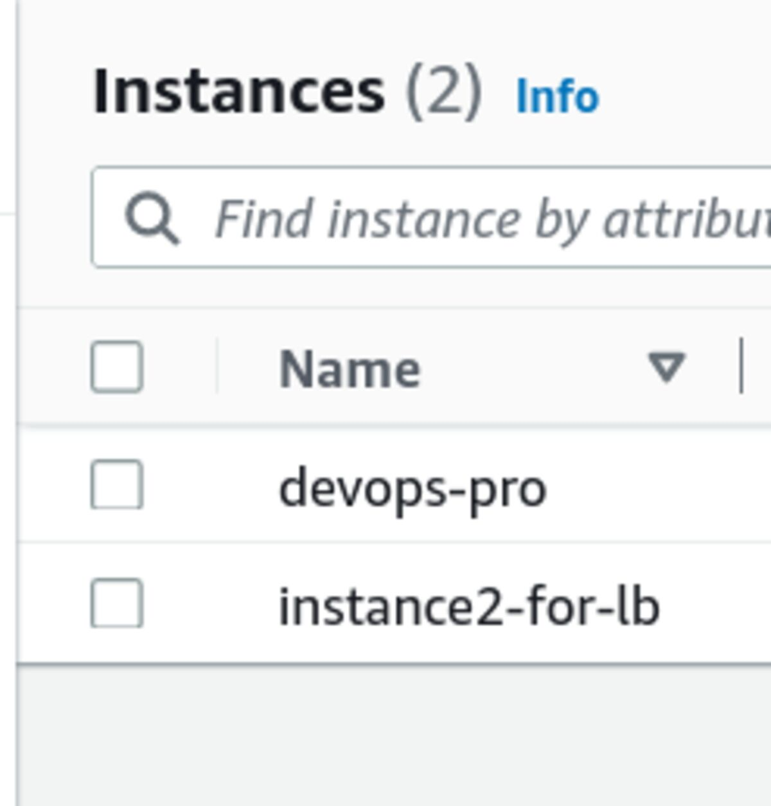
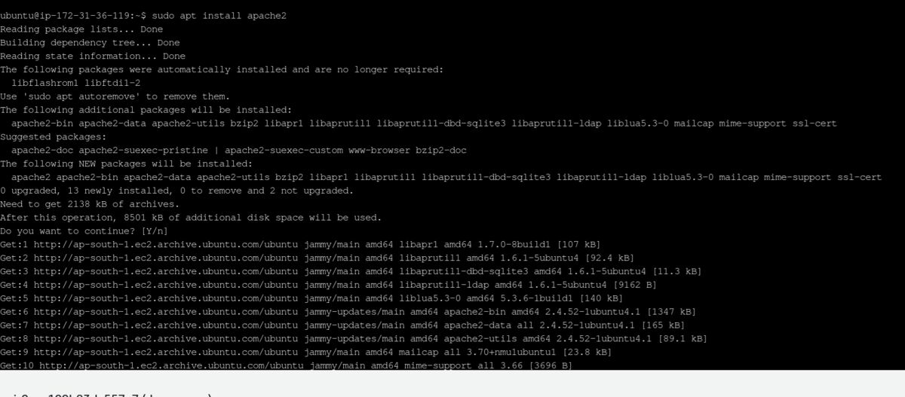
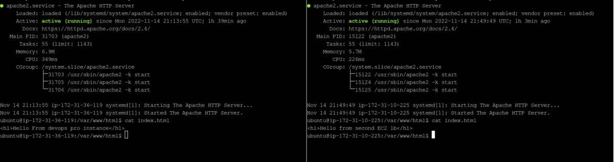

# Loadbalancer for 2 EC2 instances.

## Step 1 : Installing apache package on both ubuntu EC2 machines

- Use the following command to install apache on ubuntu machine.

  ```
  sudo apt install apache2
  ```

  

- Check if apache is running using command.

  ```
   systemctl status apache2.service
  ```

  

- If this command returns Active: active(running) then apache server is running fine.

- If the outbound security is open for http request, then using the public IP of our EC2 instance we can view the default landing page of apache.

- This html page is located in /var/www/html/index.html

  
  

--------------

## Step 2 : Changing the inboud and outbound rules of each EC2 instances.

- On the instances page click on instance id.
- Go to security tab.
- Click on the security group.
- Then create a security group for both inbound and outbound rule add a rule of http type, TCP protocol, port 80 and destination/source as custum  -> 0.0.0.0/0 that means connection from anywhere is allowed.

--------------

## Step 3 : Creating a load balancer.

- Now we have 2 EC2 instanaces on which apache server is running.
- We can use the respective public IPs to visit the landing page.
- Loadbalancer will directed the traffic from internet equally on both the machines.
- To create a load balancer, on left panes on EC2 scroll down and click _load balancers_.
- Give suitable name to it, select VPC and network mapping.
- In listeners and routing section select HTTP protocol and Port 80.
- Create a target group with http protocol and port 80 then select the required EC2 instances for which you want to use load balancer.
- Then click on **Create Load Balancer** button at bottom.
- It will take around 5 to do the provisioning.
